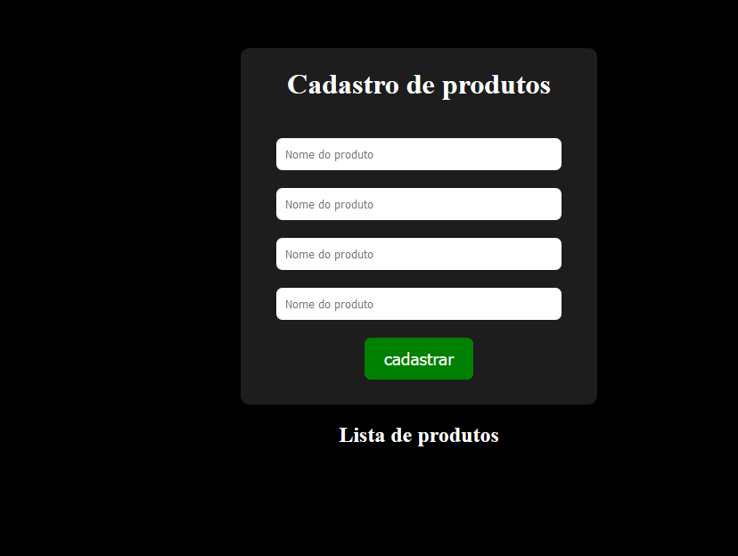

### Aulas Html e CSS

### Imagens dos projetos


### comandos mais usados

cd
cd ..

#### Sempre quando for criar um repositório novo
* 1.
 ```
 git init
 ```

 * 2.
 ```
 git add .
 ```

#### Atualizar um repositório.
 1. Adicionar dados para salvar
 ```
 git add .
 ```
 2. Comit
 git commit -m "atualização do projeto"
 
 3. Finalizar
 git push

 #### Config git

git config --global user.name "Eric Sáuma"
git config --global user.email saumaeric@gmail.com